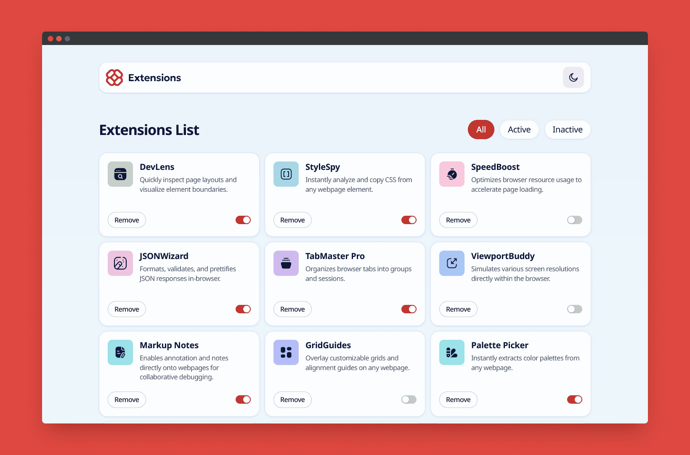

# Frontend Mentor - Browser extensions manager UI solution

This is a solution to the [Browser extensions manager UI challenge on Frontend Mentor](https://www.frontendmentor.io/challenges/browser-extension-manager-ui-yNZnOfsMAp). Frontend Mentor challenges help you improve your coding skills by building realistic projects.

## Table of contents

- [Overview](#overview)
  - [The challenge](#the-challenge)
  - [Screenshot](#screenshot)
  - [Links](#links)
- [My process](#my-process)
  - [Built with](#built-with)
    <!-- - [What I learned](#what-i-learned) -->
    <!-- - [Continued development](#continued-development) -->
    <!-- - [Useful resources](#useful-resources) -->
- [Development](#development)
  - [Build and dev scripts](#build-and-dev-scripts)
  - [Testing scripts](#testing-scripts)
  - [Other scripts](#other-scripts)
- [Deployment](#deployment)
- [Author](#author)
<!-- - [Acknowledgments](#acknowledgments) -->

## Overview

### The challenge

Users should be able to:

- [x] Toggle extensions between active and inactive states
- [x] Filter active and inactive extensions
- [x] Remove extensions from the list
- [x] Select their color theme
- [x] View the optimal layout for the interface depending on their device's screen size
- [x] See hover and focus states for all interactive elements on the page

### Screenshot



### Links

- Solution URL: [Add solution URL here](https://your-solution-url.com)
- Live Site URL: https://browser-extensions-manager.pages.dev

## My process

### Built with

- [React](https://reactjs.org/) - JS library
- [TypeScript](https://www.typescriptlang.org/)
- [Mantine](https://mantine.dev/) - React component library
- [Valtio](https://valtio.dev/) - Proxy state management

<!-- ### What I learned

Use this section to recap over some of your major learnings while working through this project. Writing these out and providing code samples of areas you want to highlight is a great way to reinforce your own knowledge.

To see how you can add code snippets, see below:

```html
<h1>Some HTML code I'm proud of</h1>
```

```css
.proud-of-this-css {
  color: papayawhip;
}
```

```js
const proudOfThisFunc = () => {
  console.log('🎉');
};
```

If you want more help with writing markdown, we'd recommend checking out [The Markdown Guide](https://www.markdownguide.org/) to learn more.

**Note: Delete this note and the content within this section and replace with your own learnings.** -->

<!-- ### Continued development

Use this section to outline areas that you want to continue focusing on in future projects. These could be concepts you're still not completely comfortable with or techniques you found useful that you want to refine and perfect.

**Note: Delete this note and the content within this section and replace with your own plans for continued development.** -->

<!-- ### Useful resources

- [Example resource 1](https://www.example.com) - This helped me for XYZ reason. I really liked this pattern and will use it going forward.
- [Example resource 2](https://www.example.com) - This is an amazing article which helped me finally understand XYZ. I'd recommend it to anyone still learning this concept.

**Note: Delete this note and replace the list above with resources that helped you during the challenge. These could come in handy for anyone viewing your solution or for yourself when you look back on this project in the future.** -->

## Development

I forced myself to use the defaults that came with [Mantine's Vite template](https://github.com/mantinedev/vite-template), which means using Yarn as package manager. Turns out it's pretty good, particularly the `yarn.lock` file which looks a lot cleaner/readable than npm's `package-lock.json`.

See [Corepack](https://yarnpkg.com/corepack) if you need help setting up Yarn on your machine.

To get started, run `yarn` (or `yarn install`) in the terminal.

To install dependencies, use `yarn add <packagename>`; for dev dependencies, include the `-D`/`--dev` flag, e.g., `yarn add -D <packagename>`.

To run the scripts below, use `yarn run <scriptname>`.

### Build and dev scripts

- `dev` – start development server
- `build` – build production version of the app
- `preview` – locally preview production build

### Testing scripts

- `typecheck` – checks TypeScript types
- `lint` – runs ESLint
- `prettier:check` – checks files with Prettier
- `vitest` – runs vitest tests
- `vitest:watch` – starts vitest watch
- `test` – runs `vitest`, `prettier:check`, `lint` and `typecheck` scripts

### Other scripts

- `storybook` – starts storybook dev server
- `storybook:build` – build production storybook bundle to `storybook-static`
- `prettier:write` – formats all files with Prettier

## Deployment

This app is deployed on Cloudflare Pages, with automatic deployments enabled for the `develop` and `staging` branches (preview deploys) and `master` branch (production deploy).

Preview deployments can be accessed at https://develop.browser-extensions-manager.pages.dev and https://staging.browser-extensions-manager.pages.dev

## Author

- Website - [Josh Javier](https://joshjavier.com/)
- Frontend Mentor - [@joshjavier](https://www.frontendmentor.io/profile/joshjavier)
- Twitter - [@joshjavierr](https://www.twitter.com/joshjavierr)
- LinkedIn - [Josh Javier](https://www.linkedin.com/in/joshjavier/)

<!-- ## Acknowledgments

This is where you can give a hat tip to anyone who helped you out on this project. Perhaps you worked in a team or got some inspiration from someone else's solution. This is the perfect place to give them some credit.

**Note: Delete this note and edit this section's content as necessary. If you completed this challenge by yourself, feel free to delete this section entirely.** -->
